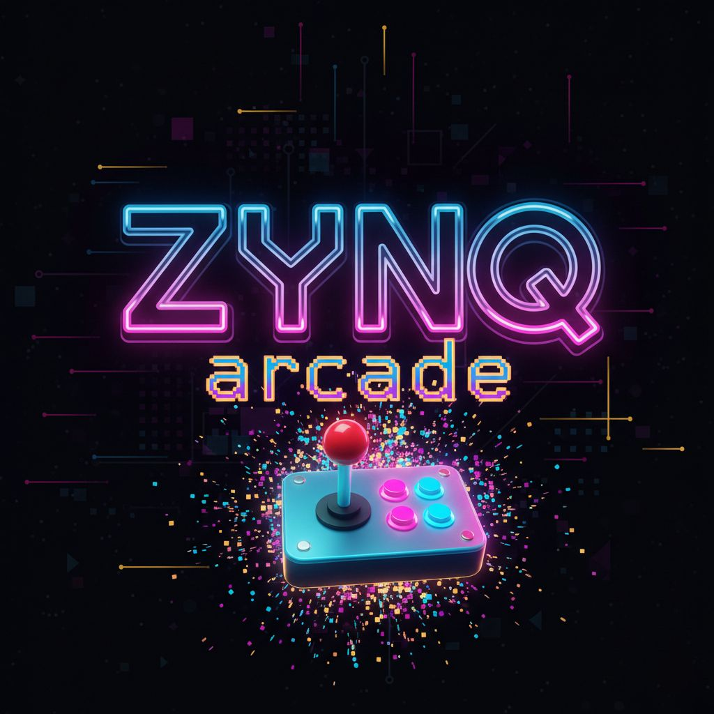

# ZYNQ ARCADE

ZYNQ Arcade is an arcade gaming platform that can be configured to run from the many different boards available that contain the ZYNQ 7000 series SoC. With the use of a Gaming Adapter Board which provides VGA Display, 2 Channel Audio, PS2 Keyboard, Arcade Joystick Support and a Game Select Dipswitch, many arcade games can be easily loaded into the ZYNQ FPGA from a MicroSD Card.
